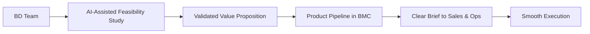

# 🚀 Empowering Business Development  
## with AI for Smarter Product Planning

**Digital Literacy Initiative**  
*Freight Forwarding | Value Pipeline Clarity | AI-Driven Execution*

---

## 🗺️ Agenda

1. 🌍 The Problem: Why We’re Here  
2. 🎯 Our Goal: Clarity in Product & Value  
3. 🔁 Current Pain: How Work Flows Today  
4. 💡 The Vision: AI-Powered Pipeline  
5. 🧠 Digital Literacy: What It Means for BD  
6. 🤖 How AI Helps You (BD Team)  
7. 🛠️ Tools You’ll Use (No Coding!)  
8. 📅 Roadmap: From Training to Execution  
9. 📊 Expected Outcomes & Impact  
10. 🙌 Your Role in This Change  
11. 💬 Final Message & Next Steps  

---

## 🌍 The Challenge We Face

- **No clear product pipeline** in Business Model Canvas (BMC)
- Value propositions are reactive, not strategic
- Sales & Operations teams are **overloaded** with unclear demands
- BD teams spend time on strategy, but lack tools to **validate and execute**

> 🔴 Result: Misalignment, overcapacity, delayed launches

---

## 🎯 Our Goal

> **Enable Business Development to own the product pipeline**  
> using **AI + digital tools**, so that:
>
> - **Operations** can execute efficiently  
> - **Sales** can sell with clarity  
> - **Leadership** sees a clear roadmap

---

## 🔄 The Current Flow (Pain Points)

No validation. No data. No pipeline.

---

## 💡 The Vision: AI-Powered Product Pipeline

BD becomes the **product engine**, not just idea generators.

---

## 🧠 What is Digital Literacy in Our Context?

It’s not about coding. It’s about:

- Using AI tools to **analyze markets, routes, pricing, risks**
- Turning ideas into **feasibility reports** in hours, not weeks
- Building **structured value propositions** with data
- Managing a **living product pipeline** in BMC

> 💬 “Digital literacy = using AI as your co-pilot for smarter decisions”

---

## 🤖 How AI Helps BD Teams

| Task | AI Tool Support |
|------|-----------------|
| Market Research | Summarize trends, competitors, regulations |
| Feasibility Studies | Analyze routes, costs, demand forecasts |
| BMC Development | Auto-generate customer segments, channels, revenue models |
| Risk Assessment | Identify operational/legal risks by region |
| Proposal Drafting | Generate client-ready decks & emails |

> ✅ Faster, data-backed, consistent output

---

## 🛠️ Tools We’ll Use (Beginner-Friendly)

- **ChatGPT / Copilot / Gemini** – Brainstorming & drafting
- **Perplexity.ai** – Deep research with sources
- **Notion + AI templates** – Track product pipeline
- **Miro + AI** – Visualize BMC & customer journeys
- **Google Sheets + AI add-ons** – Quick cost modeling

> No technical skills needed. Just curiosity.

---

## 📅 Initiative Roadmap

1. **Week 1–2**: AI Literacy Workshop (hands-on)
2. **Week 3**: Pilot – One product idea → AI feasibility study
3. **Week 4**: Review & refine with Ops/Sales feedback
4. **Ongoing**: Monthly “Product Pitch” with AI reports

> 🏆 Reward best AI-powered proposal each month

---

## 📊 Expected Outcomes

| Metric | Before | After |
|-------|--------|-------|
| Time to Feasibility | 2–4 weeks | 3–5 days |
| Ops Overload Complaints | High | Reduced by 50% |
| Clear Product Pipeline | None | 3–5 active products |
| BD Confidence | Low | High (with AI support) |

---

## 🙌 Your Role in This Change

**Business Development Team:**
- Learn AI tools (we’ll train you)
- Own the product pipeline
- Deliver **validated ideas**, not just concepts

**Leadership:**
- Support training & time allocation
- Recognize data-driven proposals

**Ops & Sales:**
- Give feedback early
- Focus on execution, not strategy

---

## 💬 Final Message

> “We don’t need more ideas.  
> We need **better-prepared** ideas.”  

Let’s use AI to **do the heavy lifting** so our teams can focus on what they do best.

**Empowered BD → Clear Products → Happy Ops & Sales**

---

## 🙏 Thank You  
Let’s build the future — one AI-assisted product at a time.

📧 Contact: [Your Name / Email]  
📅 Next: AI Workshop – [Insert Date]

> #DigitalLiteracy #AIForLogistics #ProductPipeline #FreightForwarding
