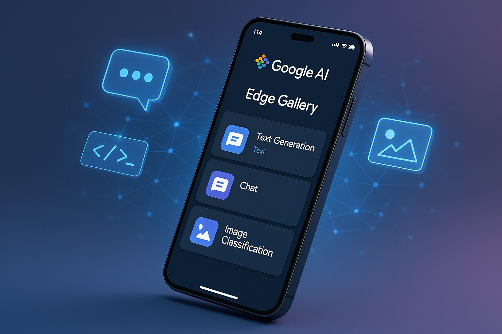
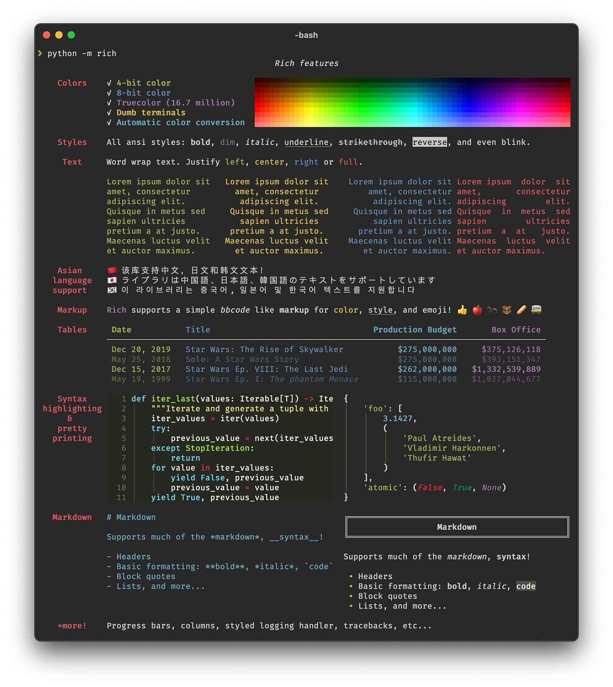

<!-- Cover Slide -->

# Multi-Platform AI-Enabled 
## Business Application Framework
Project Overview
```text
Flexible framework for building AI-powered business applications with support for web, Android, and CLI clients. 

Features both centralized and edge AI capabilities.
```

---
# Outlines
1. **Problem Statement** - Need for AI in business apps
2. **Solution Architecture** - Multi-platform with flexible AI
3. **Implementation Options** - Server vs Client-side AI
4. **Technology Stack** - Per platform breakdown
5. **Roadmap** - Phased approach
6. **Cost-Benefit Analysis** - ROI projection
7. **Demo Scenarios** - Live examples
8. **Q&A** - Technical deep-dive

---
<!-- _class: s-slide -->

# Goals

everything is now **AI**, 
.. at least having an AI (**powered with AI**)

because business evolved, 
we adapt, 
and we want to lead our industry.

that is us.., making commitment to **work smart**

and start with utilising AI App stack

---
<!-- _class: m-slide -->
<!-- Architecture Design -->

# Architecture Design 
AI Deployment Strategies
1 **Centralized AI Server**  
When to use: Complex models, heavy processing, shared resources  
- Large language models (>1GB)  
- Multi-modal processing  
- Collaborative AI features  
- Centralized learning/training  

2 **Client-Side AI (Serverless)**  
When to use: Privacy-first, offline capability, low latency  
- Web: TensorFlow.js, ONNX Runtime Web, WebAssembly models  
- Android: TensorFlow Lite, ML Kit, ONNX Runtime Mobile  
- Both: Can run models up to ~500MB efficiently  

3 **Hybrid Approach (Recommended)**  
- Light models on client for immediate response  
- Heavy processing on server when needed  
- Seamless fallback between local/remote  

---
<!-- Server Component -->
<!-- _class: m-slide -->
## Server Component (Optional AI Backend)

**Technology Stack:**  
- Framework: FastAPI (Python) or Express (Node.js)  
- AI Runtime: Transformers, ONNX, TensorFlow Serving  
- Database: PostgreSQL + Redis + Vector DB (Pinecone/Weaviate)  
- Protocols: HTTP/3, gRPC, REST, WebSocket, GraphQL  
- Container: Docker + Kubernetes  

**Core Services:**  
- Model serving and versioning  
- Complex inference tasks  
- Training/fine-tuning pipelines  
- Analytics and insights generation  
- Collaborative AI features  


---
<!-- Web Client -->
<!-- _class: m-slide -->

## Web Client

**Technology Stack:**  
- Framework: SvelteKit / Next.js / Vue 3  
- UI: Tailwind CSS + Shadcn/ui  

**Local AI Options:**  
- TensorFlow.js (full ML framework)  
- ONNX Runtime Web (cross-platform models)  
- Transformers.js (Hugging Face models in browser)  
- WebLLM (LLMs in browser via WebGPU)  
- MediaPipe (Google's on-device ML)  

**Database:** IndexedDB for local storage  
**PWA:** Full offline capability  

**AI Capabilities Without Server:**  
- Text generation (up to 7B parameter models)  
- Image classification and object detection  
- Speech recognition (Web Speech API)  
- Sentiment analysis  
- Document processing  
- Real-time translation  

---

<!-- Android Client -->
<!-- _class: m-slide -->

## Android Client

**Technology Stack:**  
- Language: Kotlin / Java  
- Architecture: MVVM + Clean Architecture  

**Local AI Options:**  
- TensorFlow Lite (primary)  
- ML Kit (Google's on-device SDK)  
- ONNX Runtime Mobile  
- PyTorch Mobile  
- Qualcomm Neural Processing SDK  

**Database:** Room + SQLite  
**UI:** Jetpack Compose  

**AI Capabilities Without Server:**  
- All web capabilities plus:  
- Custom model training on-device  
- Background AI processing  
- Camera-based AI (OCR, AR)  
- Accelerated inference via NPU/GPU  

---

<!-- Python CLI -->

## Python CLI

**Technology Stack:**  
- Framework: Typer / Click / Python-Fire  
- Local AI: Full Python ML ecosystem  
- Audio: Local Whisper, Piper TTS  
- Terminal UI: Rich / Textual  

---

<!-- Implementation Roadmap -->
<!-- _class: s-slide -->

# Implementation Roadmap

**Phase 1: Foundation (Weeks 1-3)**  
**Phase 2: Business Features (Weeks 4-6)**  
**Phase 3: Advanced AI (Weeks 7-9)**  
**Phase 4: Platform Expansion (Weeks 10-12)**
**Phase 5: Ecosystem (Weeks 13-15)** 

---

## Implementation Roadmap (Cont.)
**Phase 1: Foundation (Weeks 1-3)**  
- **Core Framework:**  
  - Business logic abstraction layer  
  - Plugin architecture for different app types  
  - Data model flexibility  
  - Authentication system  
- **Client-Side AI Setup:**  
  - Model loading infrastructure  
  - Inference pipelines  
  - Performance benchmarking  

---

## Implementation Roadmap (Cont.)
**Phase 2: Business Features (Weeks 4-6)**  
- **Configurable Modules:**  
  - Entity management (customers, inventory, etc.)  
  - Workflow engine  
  - Reporting framework  
  - Form builder  
- **AI Integration Points:**  
  - Natural language commands  
  - Intelligent automation  
  - Predictive features  

---

## Implementation Roadmap (Cont.)
**Phase 3: Advanced AI (Weeks 7-9)**  
- **Local Model Deployment:**  
  - Model optimization (quantization, pruning)  
  - Model selection based on device capability  
  - Caching and preloading strategies  
- **Optional Server AI:**  
  - Complex model endpoints  
  - Federated learning setup  
  - Model marketplace  

---

## Implementation Roadmap (Cont.)
**Phase 4: Platform Expansion (Weeks 10-12)**  
- **Cross-Platform Features:**  
  - Unified AI model format  
  - Sync protocols  
  - Progressive enhancement  

**Phase 5: Ecosystem (Weeks 13-15)**  
- **Developer Tools:**  
  - No-code AI integration  
  - Visual workflow builder  
  - Model fine-tuning interface  
  - Plugin marketplace  

---
<!-- _class: m-slide -->
<!-- Client-Side AI Implementation -->

## Client-Side AI Implementation  

**Web Browser AI Stack**  
```js
// Example: Running Llama 2 in browser
import { WebLLM } from '@mlc-ai/web-llm';

const llm = new WebLLM();
await llm.load('Llama-2-7b-chat-q4');
const response = await llm.generate(prompt);
// Example: TensorFlow.js for custom models
import * as tf from '@tensorflow/tfjs';
const model = await tf.loadLayersModel('/models/custom/model.json');
```

**Android Local AI**  
```kotlin
// TensorFlow Lite example
class LocalAI(context: Context) {
    private val interpreter: Interpreter
    
    init {
        val model = loadModelFile(context, "model.tflite")
        interpreter = Interpreter(model)
    }    
    fun inference(input: Array<FloatArray>): Array<FloatArray> {
        val output = Array(1) { FloatArray(OUTPUT_SIZE) }
        interpreter.run(input, output)
        return output
    }
}
```

---
<!-- _class: m-slide -->

## Flexible Application Types
1. **ERP Configuration**  
   - Inventory management with AI predictions  
   - Supply chain optimization  
   - Financial forecasting  
   - HR automation  

2. **No-Code Platform**  
   - Visual AI workflow builder  
   - Drag-drop model integration  
   - Custom business logic  
   - API generation  

3. **Custom Business Apps**  
   - Healthcare management  
   - Education platforms  
   - Retail systems  
   - Manufacturing tools  

---

<!-- Key Recommendations -->
<!-- _class: m-slide -->


## Key Recommendations
1. **Model Selection Strategy**  
For Client-Side Deployment:
    - Quantized models (INT8/INT4)  
    - Model size < 100MB for web, < 500MB for mobile  
    - Use model splitting for larger models  
    - Progressive loading based on features used  

2. **Offline-First Architecture**  
```javascript
// Service Worker for web
self.addEventListener('fetch', event => {
    event.respondWith(
        caches.match(event.request)
            .then(response => response || fetch(event.request))
    );
});
```

3. **Performance Optimization**
    - WebWorkers for web AI inference  
    - GPU acceleration where available  
    - Model caching strategies  
    - Lazy loading of AI features  

---
<!-- Potential Issues & Solutions -->
<!-- _class: m-slide -->

## Potential Issues & Solutions

1. **Browser Limitations**  
   - Issue: Memory constraints, no GPU access  
   - Solution:  
     - WebGPU API (emerging standard)  
     - Model chunking  
     - Hybrid execution (partial local, partial server)  
2. **Mobile Battery/Performance**  
   - Issue: AI drains battery quickly  
   - Solution:  
     - Adaptive quality based on battery level  
     - Background processing limits  
     - Edge TPU utilization  

3. **Model Distribution**  
   - Issue: Large model downloads  
   - Solution:  
     - CDN distribution, Delta updates, P2P model sharing, Progressive model enhancement  

4. **Cross-Platform Compatibility**  
   - Issue: Different AI frameworks per platform  
   - Solution:  
     - ONNX as universal format  
     - Model conversion pipelines  
     - Shared preprocessing code  

---

<!-- Development Tools -->


## Development Tools

**AI Model Optimization**  
- Quantization: TensorFlow Lite Converter  
- Pruning: TensorFlow Model Optimization Toolkit  
- Compression: ONNX Runtime optimization  
- Conversion: Various converters (TF→ONNX→TFLite)  

**Testing Framework**  
- Model accuracy benchmarks  
- Performance profiling  
- Cross-platform validation  
- A/B testing infrastructure  

---

<!-- Future Possibilities -->


## Future Possibilities

**Emerging Technologies**  
- WebGPU for 10x faster browser AI  
- Federated learning for privacy  
- Neural architecture search  
- AutoML integration  

**Platform Evolution**  
- AR/VR interfaces  
- Voice-first interactions  
- Ambient computing  
- Edge AI clusters  

---
<!-- Cost Analysis -->


# Cost Analysis

**Client-Side Only**  
- Pros: No server costs, full privacy, works offline  
- Cons: Limited model size, device-dependent performance  

**Hybrid Approach**  
- Pros: Best of both worlds, cost-efficient  
- Cons: More complex architecture  

**Estimated Costs**  
- Development: $50-150k depending on scope  
- Infrastructure: $0-5k/month (hybrid approach)  
- Maintenance: 20% of development annually  

---

<!-- Success Metrics -->


# Success Metrics

**Technical KPIs**  
- Client-side inference < 100ms  
- Model load time < 5s  
- Offline functionality 100%  
- Cross-platform model compatibility  

**Business KPIs**  
- Development velocity  
- Feature adoption rate  
- User satisfaction  
- Total cost of ownership  

---
<!-- _class: s-slide -->
##### Thank You
