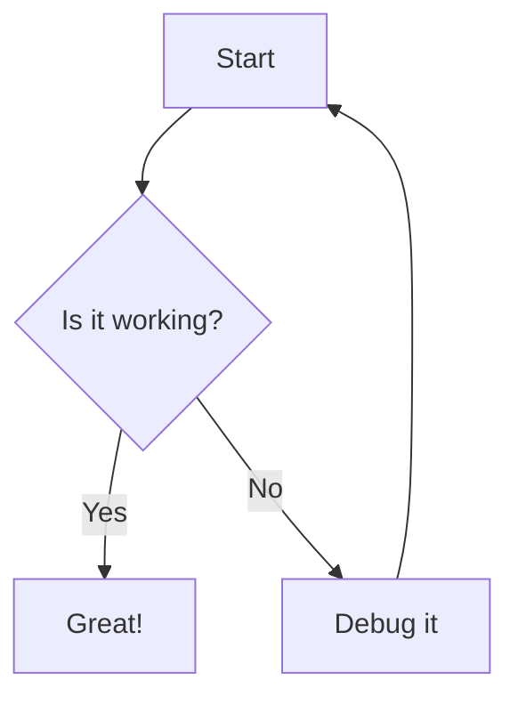

Hi, this app can give you the example of how capable i am to give you an clear explanation through common presentatble
renderer to support visualizing the data in the conversation session.

Here is  example of the timeline visualization:

```timeline
[
  {
    "id": 1,
    "content": "Project Started",
    "start": "2024-01-01",
    "type": "point"
  },
  {
    "id": 2,
    "content": "Development Phase",
    "start": "2024-01-15",
    "end": "2024-02-15",
    "type": "range"
  },
  {
    "id": 3,
    "content": "Testing Phase",
    "start": "2024-02-16",
    "end": "2024-03-01",
    "type": "range"
  }
]
```

and this is other kind of visualization:
## Audio Test

```audio
https://www.learningcontainer.com/wp-content/uploads/2020/02/Kalimba.mp3
```

## Video Test

```video
https://commondatastorage.googleapis.com/gtv-videos-bucket/sample/BigBuckBunny.mp4
```

## Code Block

This is a javascript code:

```javascript
function greet(name) {
    return `Hello, ${name}!`;
}
```

And json code:

```json
{
  "users": [
    {
      "id": 1,
      "name": "John Doe",
      "email": "john@example.com",
      "role": "developer",
      "active": true,
      "projects": ["web-app", "mobile-app"]
    },
    {
      "id": 2,
      "name": "Jane Smith",
      "email": "jane@example.com",
      "role": "designer",
      "active": true,
      "projects": ["design-system"]
    }
  ],
  "total": 2,
  "status": "success"
}
```

## Chart
here is barchart:

```chart
{
    "type": "bar",
    "data": {
        "labels": ["Jan", "Feb", "Mar", "Apr", "May"],
        "datasets": [{ "label": "Sales",      "data": [12, 19, 3, 5, 2],
        "backgroundColor": ["#FF6384", "#36A2EB", "#FFCE56", "#4BC0C0", "#9966FF"]
        }]
    }
}
```
# Mermaid
Here's a Mermaid diagram:
