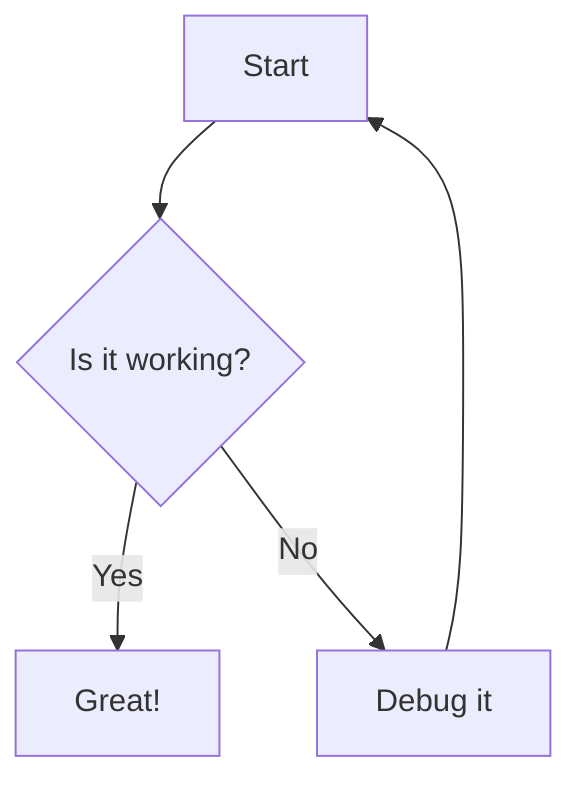

Hi, this app can give you the example of how capable i am to give you an clear explanation through common presentatble
renderer to support visualizing the data in the conversation session.

## Single Image
```image
/media/barbie-doll-clipart.jpg
```

## Multiple Images Gallery
```image
/media/barbie-doll-clipart.jpg
/media/barbie-movies.jpg
```

## Audio Test

```audio
/media/Francis%20Lai%20-%20Love%20Story.mp3
```

## Video Test

```video
/media/shinchan0st.mp4
```

## Code Block

This is a javascript code:

```javascript
function greet(name) {
    return `Hello, ${name}!`;
}
```

And json code:

```json
{
  "users": [
    {
      "id": 1,
      "name": "John Doe",
      "email": "john@example.com",
      "role": "developer",
      "active": true,
      "projects": ["web-app", "mobile-app"]
    },
    {
      "id": 2,
      "name": "Jane Smith",
      "email": "jane@example.com",
      "role": "designer",
      "active": true,
      "projects": ["design-system"]
    }
  ],
  "total": 2,
  "status": "success"
}
```
## Data Tables

### Employee Data
```csv
name,age,city,salary,department,hire_date
John Doe,30,New York,75000,Engineering,2022-01-15
Jane Smith,25,San Francisco,85000,Product,2023-03-20
Bob Johnson,35,Chicago,65000,Sales,2021-11-08
Alice Brown,28,Seattle,80000,Marketing,2022-09-12
Charlie Wilson,42,Austin,95000,Engineering,2020-05-25
Diana Lee,31,Portland,70000,Design,2023-01-30
```

### Product Inventory
```table
Product,Price,Stock,Category,Rating
Laptop,$1299,15,Electronics,4.5
Mouse,$25,150,Electronics,4.2
Keyboard,$89,75,Electronics,4.7
Chair,$299,32,Furniture,4.3
Desk,$599,18,Furniture,4.6
Monitor,$349,28,Electronics,4.4
```

Here is  example of the timeline visualization:

```timeline
[
  {
    "id": 1,
    "group":"PMO",
    "content": "Project Started",
    "start": "2024-01-01",
    "type": "point"
  },
  {
    "id": 2,
    "group":"Working",
    "content": "Development Phase",
    "start": "2024-01-15",
    "end": "2024-02-15",
    "type": "range"
  },
  {
    "id": 3,
    "group":"PMO",
    "content": "Testing Phase",
    "start": "2024-02-16",
    "end": "2024-03-01",
    "type": "range"
  }
]
```

**here is barchart:**
```chart
{
    "type": "bar",
    "data": {
        "labels": ["Jan", "Feb", "Mar", "Apr", "May"],
        "datasets": [{ "label": "Sales",      "data": [12, 19, 3, 5, 2],
        "backgroundColor": ["#FF6384", "#36A2EB", "#FFCE56", "#4BC0C0", "#9966FF"]
        }]
    }
}
```

**Pie:**
```chart
{
    "type": "pie",
    "data": {
        "labels": ["Jan", "Feb", "Mar", "Apr", "May"],
        "datasets": [{ "label": "Sales",      "data": [12, 19, 3, 5, 2],
        "backgroundColor": ["#FF6384", "#36A2EB", "#FFCE56", "#4BC0C0", "#9966FF"]
        }]
    }
}
```

**Line:**
```chart
{
    "type": "line",
    "data": {
        "labels": ["Jan", "Feb", "Mar", "Apr", "May"],
        "datasets": [{ "label": "Sales",      "data": [12, 19, 3, 5, 2],
        "backgroundColor": ["#FF6384", "#36A2EB", "#FFCE56", "#4BC0C0", "#9966FF"]
        }]
    }
}
```

# Mermaid
Here's a Mermaid diagram:
